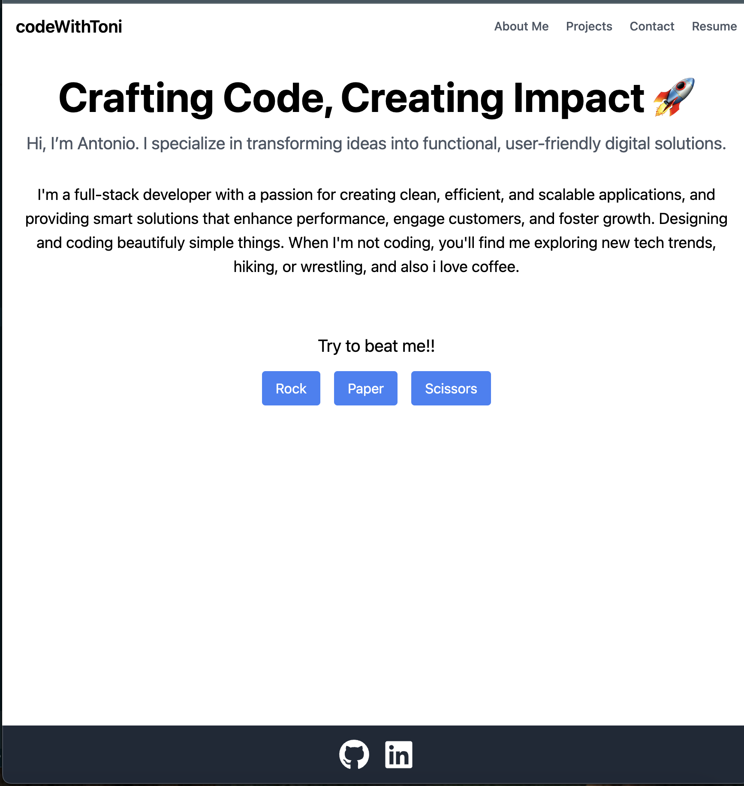

# [AntonioKOD's Portfolio-React Repository](https://github.com/AntonioKOD/Portfolio-React)

This repository contains the source code for my personal portfolio website, built using React. The site showcases my projects, skills, and experience as a software developer.

## Features

- **Responsive Design**: Ensures optimal viewing experience across various devices.
- **Project Showcase**: Highlights selected projects with descriptions and links.
- **About Me**: Provides an overview of my background and expertise.
- **Contact Form**: Allows visitors to get in touch directly through the website.

## Technologies Used

- **React**: JavaScript library for building user interfaces.
- **Tailwind CSS**: Utility-first CSS framework for styling.
- **React Router**: For handling navigation within the application.

## Installation

To run this project locally:

1. **Clone the repository**:

   ```bash
   git clone https://github.com/AntonioKOD/Portfolio-React.git
   ```

2. **Navigate to the project directory**:

   ```bash
   cd Portfolio-React
   ```

3. **Install dependencies**:

   ```bash
   npm install
   ```

4. **Start the development server**:

   ```bash
   npm run dev
   ```

   The application will be available at `http://localhost:3000`.

## Usage

- **Projects**: Detailed information about various projects I've worked on.
- **About**: Background information and skills.
- **Contact**: Form to send messages directly to me.

## Screenshot



## License

This project is licensed under the MIT License.

## Acknowledgements

Special thanks to the open-source community for the tools and resources that made this project possible.

---

For more information, visit the [GitHub repository](https://github.com/AntonioKOD/Portfolio-React).
